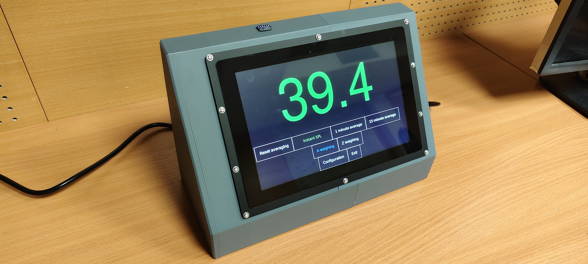
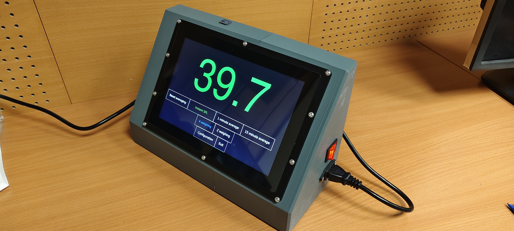
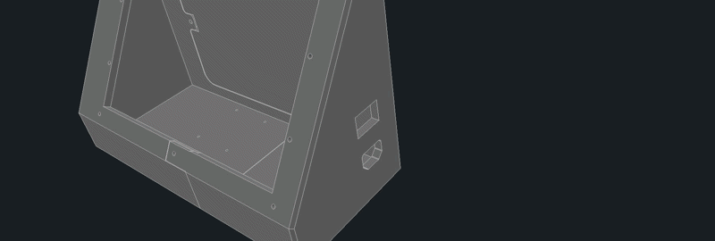
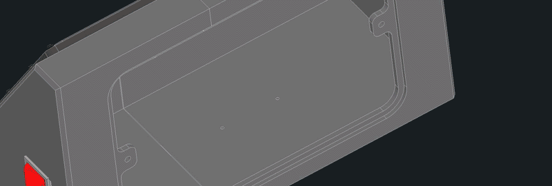
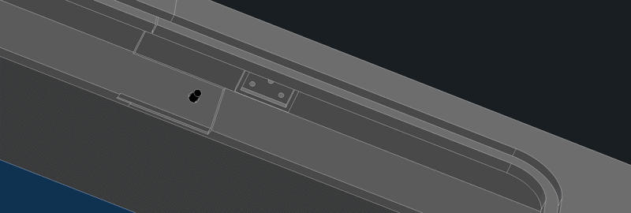

# Concert SPL Monitor Enclosure

[STL files Here](https://grabcad.com/library/simple-concert-monitor_mechanical-1)

---

This repository contains the mechanical design of the enclosure for the [Simple Concert Monitor](https://github.com/MiCyg/simple-concert-monitor) software. All parts were developed using Autodesk Inventor.

The first version of the enclosure looks as follows:

	
	

---

# Assembly

1. Glue the two main enclosure parts together.

	

2. Mount the connectors.

	

3. Mount the display with its PCB.

	

4. Install the Raspberry Pi and the power supply.

	

5. Glue the microphone to the top section.

	

6. Attach and screw the back plate.

	

# Required Components

* Raspberry Pi
* I2S microphone
* Touchscreen display
* Power supply
* Mounting hardware (screws / inserts as required)

# Contribution

This enclosure is still under development.

If you would like to contribute to the project, feel free to fork the repository and submit a Pull Request with your improvements.
